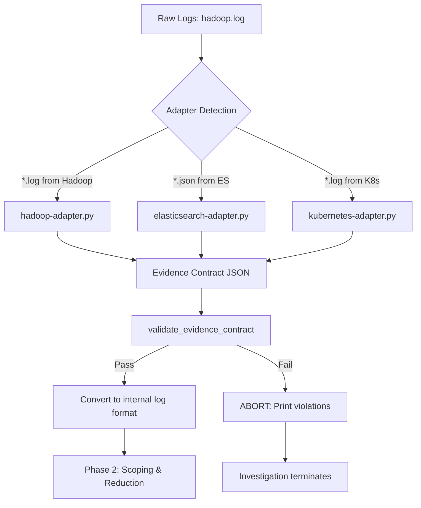

# Phase 1: Evidence Contract Enforcement

**Purpose**: Convert raw, vendor-specific logs into LLM-safe, standardized evidence that Copilot can reason about reliably.

## The Problem

Raw logs from production systems (Hadoop, Elasticsearch, Kubernetes, databases) contain:
- **Vendor jargon**: "DataNode", "NameNode", "kubelet", "etcd"
- **Variable timestamp formats**: Hadoop uses `yyyy-MM-dd HH:mm:ss,SSS`, K8s uses RFC3339, databases use epoch milliseconds
- **Unstable severity levels**: DEBUG, TRACE, FATAL, CRITICAL (non-standard levels that vary by system)
- **Duplicate events**: Same error repeated hundreds of times, overwhelming token limits
- **Missing context**: Lifecycle events (startup/shutdown) often absent, making correlation impossible

**Without a contract**, Copilot receives contaminated inputs and produces unreliable root cause analysis.

## The Solution: Evidence Contract

Phase 1 enforces a **strict contract** between raw logs and the investigation pipeline:

### Contract Schema

```json
{
  "source": "hadoop | elasticsearch | kubernetes | postgres | ...",
  "quality": {
    "completeness": "COMPLETE | PARTIAL | INCOMPLETE",
    "confidence_penalty": 0-100,
    "notes": ["Human-readable quality issues"]
  },
  "signals": [
    {
      "event": "resource_allocation_failure",  // Generic, not "DataNode OOM"
      "severity": "INFO | WARN | ERROR",        // Only 3 levels
      "component": "storage_service",           // Generic, not "DataNode"
      "count": 9,                               // Aggregation: 9 occurrences
      "first_seen": "2015-03-16T23:17:47Z",    // ISO-8601 UTC
      "last_seen": "2015-03-16T23:17:57Z"      // ISO-8601 UTC (optional)
    }
  ]
}
```

### Contract Rules

1. **Timestamp Normalization**
   - **Rule**: All timestamps MUST be ISO-8601 UTC format: `YYYY-MM-DDTHH:MM:SSZ`
   - **Why**: Prevents timezone confusion, enables reliable temporal correlation
   - **Enforced by**: `validate_evidence_contract()` regex: `^\d{4}-\d{2}-\d{2}T\d{2}:\d{2}:\d{2}Z$`

2. **Severity Reduction**
   - **Rule**: Only `INFO`, `WARN`, `ERROR` allowed
   - **Why**: LLMs struggle with 7+ severity levels; 3 levels force clear signal prioritization
   - **Mapping**:
     - `DEBUG`, `TRACE` → Dropped (noise)
     - `INFO`, `NOTICE` → `INFO`
     - `WARN`, `WARNING`, `CAUTION` → `WARN`
     - `ERROR`, `CRITICAL`, `FATAL` → `ERROR`

3. **Event Type Abstraction**
   - **Rule**: Event names MUST be vendor-agnostic
   - **Why**: Prevents Copilot from pattern-matching on vendor docs instead of evidence
   - **Forbidden**: `hadoop`, `datanode`, `namenode`, `spark`, `kafka`, `kubernetes`, `k8s`
   - **Examples**:
     - ❌ `DataNode registration failed`
     - ✅ `registration_failure`
     - ❌ `Kubernetes pod evicted`
     - ✅ `resource_allocation_failure`

4. **Aggregation**
   - **Rule**: Repeated events MUST be aggregated with `count`
   - **Why**: Prevents token limit exhaustion from duplicate logs
   - **Example**: 9 identical "Out of memory" errors → 1 signal with `count: 9`

5. **Quality Metadata**
   - **Rule**: Adapters MUST assess completeness and assign confidence penalties
   - **Why**: Signals to Copilot when evidence is unreliable (missing lifecycle events, crashes without context)
   - **Completeness Levels**:
     - `COMPLETE`: Lifecycle events + normal operations + errors
     - `PARTIAL`: Missing lifecycle but has operational data (penalty: 10-20%)
     - `INCOMPLETE`: Only errors or <3 events (penalty: 30-50%)

## Phase 1 Pipeline



### Step-by-Step Execution

**Step 1: Adapter Detection**
```python
if os.path.exists("evidence/hadoop.log"):
    hadoop_evidence = invoke_evidence_adapter("evidence/hadoop.log", "hadoop")
```

**Step 2: Contract Validation**
```python
is_valid, violations = validate_evidence_contract(hadoop_evidence, "hadoop")
if not is_valid:
    # Print violations and abort
    for v in violations:
        print(f"   - {v}")
    raise SystemExit("❌ Contract violations detected. Aborting investigation.")
```

**Step 3: Quality Penalty Propagation**
```python
evidence_quality_penalties = [{
    "source": "hadoop_logs",
    "reason": "; ".join(hadoop_evidence['quality']['notes']),
    "penalty": -hadoop_evidence['quality']['confidence_penalty']
}]
```

**Step 4: Signal Normalization**
```python
for signal in hadoop_evidence["signals"]:
    timestamp = signal.get("first_seen")
    message = f"{signal['event']} (count: {signal.get('count', 1)})"
    log_line = f"{timestamp} {signal['severity']} {source} {message}\n"
    raw_logs.append(log_line)
```

## Failure Modes & Handling

### 1. Invalid Timestamp Format
**Violation**: `Signal 3: invalid timestamp format (expected ISO-8601 UTC): 2015-03-16 23:17:45`

**Cause**: Adapter failed to normalize timestamp to UTC

**Handling**: Investigation **ABORTS** immediately. No partial processing.

**Why**: Temporal correlation is Phase 3's foundation. Bad timestamps = unreliable causation.

---

### 2. Vendor Jargon in Event Types
**Violation**: `Signal 5: event type contains vendor jargon: 'DataNode_registration_failed'`

**Cause**: Adapter didn't abstract vendor-specific terminology

**Handling**: Investigation **ABORTS** immediately.

**Why**: Copilot will hallucinate solutions from vendor docs instead of analyzing evidence.

---

### 3. Non-Standard Severity Levels
**Violation**: `Signal 2: invalid severity 'CRITICAL' (allowed: INFO, WARN, ERROR)`

**Cause**: Adapter passed through raw severity levels

**Handling**: Investigation **ABORTS** immediately.

**Why**: Severity is used for filtering (Phase 2) and hypothesis ranking (Phase 3). Non-standard levels break logic.

---

### 4. Missing Quality Metadata
**Violation**: `Missing 'quality' metadata`

**Cause**: Adapter didn't assess evidence completeness

**Handling**: Investigation **ABORTS** immediately.

**Why**: Without quality assessment, Copilot can't calibrate confidence. A 90% root cause from incomplete evidence is meaningless.

---

### 5. Duplicate Events (No Aggregation)
**Detection**: If 5+ signals have identical `event` + `severity` + `component`

**Cause**: Adapter didn't implement aggregation logic

**Handling**: **Warning printed**, investigation continues (not critical, just inefficient)

**Why**: Wastes tokens but doesn't corrupt reasoning. Future: Could auto-aggregate.

---

### 6. Empty Signal Stream
**Violation**: `Signals must be an array` (empty array)

**Cause**: Log file had no events matching adapter's parsing rules

**Handling**: Investigation **ABORTS** immediately.

**Why**: Can't investigate with zero evidence. Prevents false negatives.

---

## Quality Metadata Design

### Completeness Categories

| Category | Criteria | Confidence Penalty | Example |
|----------|----------|-------------------|---------|
| **COMPLETE** | Has lifecycle events (startup/shutdown) + normal operations + errors | 0% | Full application lifecycle captured |
| **PARTIAL** | Missing lifecycle OR normal operations | 10-20% | Only errors + some INFO events |
| **INCOMPLETE** | Only errors OR <3 total events | 30-50% | Just a crash dump with no context |

### Penalty Calculation Logic

```python
penalty = 0

# Missing lifecycle events: +10%
if not has_lifecycle_events(signals):
    penalty += 10
    notes.append("No lifecycle events detected")

# Crash without clean shutdown: +5%
if has_crash(signals) and not has_clean_shutdown(signals):
    penalty += 5
    notes.append("Crash detected without clean shutdown")

# Very sparse data (<5 events): +15%
if len(signals) < 5:
    penalty += 15
    notes.append("Sparse event stream")

completeness = "COMPLETE" if penalty == 0 else "PARTIAL" if penalty < 30 else "INCOMPLETE"
```

### Penalty Propagation

Quality penalties flow through the entire pipeline:

```
Adapter (hadoop-adapter.py)
  ↓ generates quality metadata
Phase 1 Validation
  ↓ extracts penalties
Incident Bundle (integrity section)
  ↓ "confidence_penalties": [{"source": "hadoop_logs", "penalty": -15}]
Copilot Prompt
  ↓ "Note: Evidence has 15% confidence penalty due to incomplete lifecycle coverage"
Phase 3 Hypothesis Evaluation
  ↓ Final confidence: 75% (hypothesis) - 15% (evidence) = 60%
Review Record
  ↓ ai_confidence: 60%
```

**Result**: Human reviewers see the full provenance of confidence scores, from raw log quality to final root cause.

## Validation Steps (Code Reference)

### 1. Top-Level Structure
```python
if "source" not in evidence:
    violations.append("Missing 'source' field")
if "quality" not in evidence:
    violations.append("Missing 'quality' metadata")
if "signals" not in evidence:
    violations.append("Missing 'signals' array")
```

### 2. Quality Metadata
```python
quality = evidence.get("quality", {})
if "completeness" not in quality or quality["completeness"] not in ["COMPLETE", "PARTIAL", "INCOMPLETE"]:
    violations.append(f"Invalid completeness: {quality.get('completeness')}")
if "confidence_penalty" not in quality or not isinstance(quality["confidence_penalty"], (int, float)):
    violations.append("Missing or invalid confidence_penalty")
```

### 3. Signal Validation (per signal)
```python
# Timestamp
timestamp_field = signal.get("timestamp") or signal.get("first_seen")
if not timestamp_field:
    violations.append(f"Signal {idx}: missing timestamp/first_seen")
else:
    if not re.match(r"^\d{4}-\d{2}-\d{2}T\d{2}:\d{2}:\d{2}Z$", timestamp_field):
        violations.append(f"Signal {idx}: invalid timestamp format")

# Severity
if signal["severity"] not in ["INFO", "WARN", "ERROR"]:
    violations.append(f"Signal {idx}: invalid severity")

# Event type (no vendor jargon)
forbidden_terms = ["hadoop", "datanode", "namenode", "spark", "kafka", "kubernetes", "k8s"]
if any(term in signal["event"].lower() for term in forbidden_terms):
    violations.append(f"Signal {idx}: event type contains vendor jargon")
```

## Hadoop Adapter Example

### Input: Raw Hadoop DataNode Log
```
2015-03-16 23:17:47,275 WARN org.apache.hadoop.hdfs.server.datanode.DataNode: PacketResponder: BP-108841162-10.10.34.11-1418980957430:blk_1073447896_306761, type=HAS_DOWNSTREAM_IN_PIPELINE, Exception for BP-108841162-10.10.34.11-1418980957430:blk_1073447896_306761
java.io.IOException: Premature EOF from inputStream
        at org.apache.hadoop.io.IOUtils.readFully(IOUtils.java:194)
        at org.apache.hadoop.hdfs.protocol.datatransfer.PacketReceiver.doReadFully(PacketReceiver.java:213)
        at org.apache.hadoop.hdfs.protocol.datatransfer.PacketReceiver.doRead(PacketReceiver.java:134)
```

### Output: Evidence Contract
```json
{
  "source": "hadoop",
  "quality": {
    "completeness": "PARTIAL",
    "confidence_penalty": 15,
    "notes": [
      "No lifecycle events detected",
      "Crash detected without clean shutdown"
    ]
  },
  "signals": [
    {
      "event": "resource_allocation_failure",
      "severity": "WARN",
      "component": "storage_service",
      "count": 9,
      "first_seen": "2015-03-16T23:17:47Z",
      "last_seen": "2015-03-16T23:17:57Z"
    }
  ]
}
```

### Transformations Applied

1. **Timestamp**: `2015-03-16 23:17:47,275` → `2015-03-16T23:17:47Z` (ISO-8601 UTC)
2. **Severity**: `WARN` → `WARN` (already standard)
3. **Event**: `IOException: Premature EOF` + context → `resource_allocation_failure`
4. **Component**: `DataNode` → `storage_service` (generic)
5. **Aggregation**: 9 identical events → `count: 9`, `first_seen` / `last_seen`
6. **Quality**: Detected missing lifecycle + crash → 15% penalty

## Future Adapters

The contract design is **adapter-agnostic**. Future adapters will follow the same pattern:

### Elasticsearch Adapter
```python
# adapters/elasticsearch-adapter.py
# Converts Elasticsearch JSON logs → Evidence contract
# Challenges:
# - Nested JSON fields (need flattening)
# - Variable timestamp formats (ISO8601 vs epoch millis)
# - Custom severity levels (_score, _priority)
```

### Kubernetes Adapter
```python
# adapters/kubernetes-adapter.py
# Converts K8s event logs → Evidence contract
# Challenges:
# - RFC3339 timestamps (already ISO8601, just validate)
# - Event reasons (ImagePullBackOff, Evicted, OOMKilled) → generic events
# - Pod/Container/Node names → component abstraction
```

### Database Adapter
```python
# adapters/postgres-adapter.py
# Converts Postgres logs → Evidence contract
# Challenges:
# - Epoch milliseconds → ISO-8601 UTC
# - SQL query text (sanitize PII, extract semantic intent)
# - Connection pool errors vs query errors (different event types)
```

## Testing & Validation

### Test Case 1: Valid Hadoop Evidence
```bash
$ python3 adapters/hadoop-adapter.py evidence/hadoop.log
✓ Evidence contract validated: 7 signals, quality=PARTIAL
```

### Test Case 2: Missing Timestamp
```python
# Corrupt adapter output
{"signals": [{"event": "test", "severity": "INFO"}]}  # No timestamp

$ ./sherlock --investigate
❌ Evidence contract validation FAILED:
   - Signal 0: missing timestamp/first_seen
❌ Contract violations detected. Aborting investigation.
```

### Test Case 3: Vendor Jargon
```python
# Corrupt adapter output
{"signals": [{"event": "DataNode_failure", "severity": "ERROR", "first_seen": "2015-03-16T23:17:47Z"}]}

$ ./sherlock --investigate
❌ Evidence contract validation FAILED:
   - Signal 0: event type contains vendor jargon: 'DataNode_failure'
❌ Contract violations detected. Aborting investigation.
```

### Test Case 4: Quality Penalty Propagation
```bash
$ ./sherlock --investigate
✓ Evidence contract validated: 7 signals, quality=PARTIAL

$ cat reports/incident-bundle-INC-123.json | grep -A 5 confidence_penalties
"confidence_penalties": [
  {
    "source": "hadoop_logs",
    "reason": "No lifecycle events detected; Crash detected without clean shutdown",
    "penalty": -15
  }
]
```

## Key Insights

### Why This Matters

1. **Prevents Hallucination**: Without abstraction, Copilot pattern-matches on "DataNode" and suggests tuning `dfs.datanode.max.transfer.threads` without analyzing YOUR system's resource constraints.

2. **Enables Temporal Correlation**: Phase 3 hypothesis evaluation depends on precise timestamp ordering. One bad timestamp breaks causation chains.

3. **Token Efficiency**: Aggregating 9 identical errors saves ~8KB of prompt space, allowing more deployments, commits, and metrics in the bundle.

4. **Confidence Calibration**: Quality penalties ensure that 70% confidence from complete evidence means something different than 70% from a partial crash dump.

5. **Future-Proof**: New adapters (Kafka, Cassandra, nginx) slot in without changing Phase 2-5 logic.

## Design Trade-offs

### ✅ Strict > Permissive
- **Decision**: Abort on any contract violation
- **Alternative**: Allow degraded processing (e.g., skip bad signals)
- **Rationale**: Garbage in, garbage out. Better to fail fast than produce unreliable root cause.

### ✅ Aggregation > Raw Events
- **Decision**: Adapters MUST aggregate duplicate events
- **Alternative**: Pass all events to Phase 2, let it handle deduplication
- **Rationale**: Adapters have domain knowledge (e.g., Hadoop "Premature EOF" patterns). Phase 2 is generic.

### ✅ 3 Severity Levels > 7
- **Decision**: Force reduction to INFO/WARN/ERROR
- **Alternative**: Keep vendor levels (DEBUG/TRACE/INFO/WARN/ERROR/CRITICAL/FATAL)
- **Rationale**: LLMs perform better with clear signal hierarchies. 7 levels encourage hedging.

### ✅ Vendor Abstraction > Raw Terms
- **Decision**: Ban "DataNode", "kubelet", etc. in event types
- **Alternative**: Allow vendor terms, teach Copilot to ignore them
- **Rationale**: Copilot's training data includes vendor docs. Raw terms trigger memorized solutions instead of evidence-based reasoning.

## Files Modified

- **sherlock** (lines 285-450): Added `validate_evidence_contract()`, `invoke_evidence_adapter()`, quality penalty propagation
- **adapters/hadoop-adapter.py**: Complete Hadoop → contract transformation
- **evidence/hadoop.log**: Sample Hadoop DataNode logs for testing

## Next Steps

1. **Adapter Library**: Build elasticsearch-adapter.py, kubernetes-adapter.py
2. **Auto-Detection**: Infer adapter from file extension/header instead of hardcoded paths
3. **Contract Versioning**: Add `"contract_version": "1.0"` for future schema evolution
4. **Validation CLI**: `sherlock validate-evidence evidence/hadoop.log` for adapter developers
5. **Quality Metrics**: Track adapter performance (aggregation ratio, penalty distribution)

---

**Status**: ✅ Complete (Phase 1 Hadoop Edition)
**Last Updated**: 2026-02-07
**Author**: Copilot Sherlock Team
